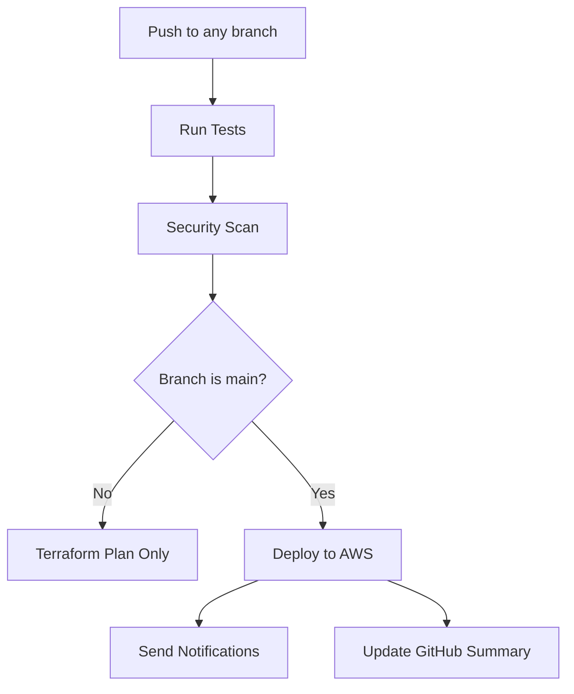

# 🚀 Configuración CI/CD para Despliegue Automático

Esta guía te ayudará a configurar el despliegue automático en AWS cuando hagas commit a la rama `main`.

## 📋 Opciones de CI/CD Disponibles

Tienes **dos opciones** para automatizar el despliegue:

### Opción 1: GitHub Actions (Recomendado ✅)
### Opción 2: Jenkins

---

## 🔧 Opción 1: Configuración GitHub Actions

### 1. Configurar Secrets en GitHub

Ve a tu repositorio en GitHub → **Settings** → **Secrets and variables** → **Actions** y añade estos secrets:

#### Secrets Requeridos:
```
AWS_ACCESS_KEY_ID          = tu-aws-access-key
AWS_SECRET_ACCESS_KEY      = tu-aws-secret-key
DATADOG_API_KEY           = tu-datadog-api-key
DATADOG_APP_KEY           = tu-datadog-app-key
```

#### Cómo obtener las credenciales:

**AWS Credentials:**
1. Ve a AWS IAM Console
2. Crea un usuario nuevo para CI/CD (ej: `lti-project-cicd`)
3. Asigna políticas: `PowerUserAccess` + `IAMFullAccess`
4. Genera Access Keys
5. Copia las keys a GitHub Secrets

**Datadog Credentials:**
1. Ve a [Datadog API Keys](https://app.datadoghq.com/organization-settings/api-keys)
2. Crea una nueva API Key
3. Ve a [Datadog Application Keys](https://app.datadoghq.com/organization-settings/application-keys)
4. Crea una nueva APP Key
5. Copia ambas keys a GitHub Secrets

### 2. Configurar Environment Protection (Opcional pero Recomendado)

1. Ve a **Settings** → **Environments**
2. Crea un environment llamado `production`
3. Configura **Protection rules**:
   - ✅ Required reviewers (1-2 personas)
   - ✅ Wait timer (5 minutos)
   - ✅ Restrict to protected branches (`main`)

### 3. Crear Backend de Terraform (Requerido)

Antes del primer despliegue, crea manualmente el backend de Terraform:

```bash
# 1. Crea el bucket S3 (cambiar nombre por uno único)
aws s3 mb s3://tu-proyecto-terraform-state --region us-east-1

# 2. Habilita versionado
aws s3api put-bucket-versioning \
  --bucket tu-proyecto-terraform-state \
  --versioning-configuration Status=Enabled

# 3. Crea tabla DynamoDB para locks
aws dynamodb create-table \
  --table-name tu-proyecto-terraform-locks \
  --attribute-definitions AttributeName=LockID,AttributeType=S \
  --key-schema AttributeName=LockID,KeyType=HASH \
  --billing-mode PAY_PER_REQUEST \
  --region us-east-1
```

### 4. Actualizar configuración del backend

Edita `tf/backend.tf` con tu nombre de bucket único:

```hcl
terraform {
  backend "s3" {
    bucket         = "tu-proyecto-terraform-state"    # 👈 Cambiar aquí
    key            = "terraform/state/terraform.tfstate"
    region         = "us-east-1"
    dynamodb_table = "tu-proyecto-terraform-locks"    # 👈 Cambiar aquí
    encrypt        = true
  }
}
```

### 5. Pipeline Workflow

Con esta configuración, el pipeline funcionará así:



#### En Pull Requests:
- ✅ Ejecuta tests
- ✅ Ejecuta security scan
- ✅ Ejecuta `terraform plan`
- ❌ **NO despliega**

#### En Push a Main:
- ✅ Ejecuta tests
- ✅ Ejecuta `terraform apply`
- ✅ Despliega infraestructura
- ✅ Envía notificaciones

---

## 🔧 Opción 2: Configuración Jenkins

### 1. Instalar Jenkins Plugins

Asegúrate de tener estos plugins instalados:
- Pipeline
- AWS Credentials
- Terraform
- Git

### 2. Configurar Credentials en Jenkins

Ve a **Manage Jenkins** → **Credentials** y añade:

```
ID: AWS_ACCESS_KEY_ID        | Type: Secret text
ID: AWS_SECRET_ACCESS_KEY    | Type: Secret text  
ID: DATADOG_API_KEY         | Type: Secret text
ID: DATADOG_APP_KEY         | Type: Secret text
```

### 3. Crear Pipeline Job

1. **New Item** → **Pipeline**
2. En **Pipeline** section:
   - Definition: `Pipeline script from SCM`
   - SCM: `Git`
   - Repository URL: tu repositorio
   - Branch: `*/main`
   - Script Path: `Jenkinsfile`

### 4. Configurar Webhook (Para Automatización)

En tu repositorio GitHub:
1. **Settings** → **Webhooks**
2. **Add webhook**
3. Payload URL: `http://tu-jenkins-url/github-webhook/`
4. Content type: `application/json`
5. Events: `Just the push event`

---

## 📋 Flujo de Trabajo Completo

### Para Desarrolladores:

1. **Crear Feature Branch:**
   ```bash
   git checkout -b feature/nueva-funcionalidad
   # Realizar cambios
   git add .
   git commit -m "feat: nueva funcionalidad"
   git push origin feature/nueva-funcionalidad
   ```

2. **Crear Pull Request:**
   - El pipeline ejecutará tests y terraform plan
   - Revisar los resultados antes de merge

3. **Merge a Main:**
   ```bash
   git checkout main
   git merge feature/nueva-funcionalidad
   git push origin main
   ```
   - 🚀 **Despliegue automático se ejecuta**

### Monitoreo del Despliegue:

1. **GitHub Actions:** Ve a la pestaña "Actions" en tu repo
2. **Jenkins:** Ve al dashboard de Jenkins
3. **AWS:** Verifica recursos en AWS Console
4. **Datadog:** Revisa el dashboard de monitoreo

---

## 🛠️ Troubleshooting

### Errores Comunes:

#### 1. "Terraform state locked"
```bash
# Solución: Desbloquear manualmente
terraform force-unlock LOCK_ID -force
```

#### 2. "AWS credentials not found"
- Verifica que los secrets estén configurados correctamente
- Verifica permisos del usuario IAM

#### 3. "Datadog API authentication failed"
- Verifica las API keys en los secrets
- Asegúrate de usar el site correcto (`.com` vs `.eu`)

#### 4. "Tests failing"
- El pipeline **NO desplegará** si los tests fallan
- Arregla los tests antes de hacer merge

### Logs Importantes:

- **GitHub Actions:** Actions tab → Workflow run → Job logs
- **Jenkins:** Build History → Console Output  
- **Terraform:** Check pipeline logs for terraform output
- **AWS CloudTrail:** Para auditar cambios en AWS

---

## 🔐 Consideraciones de Seguridad

### Secrets Management:
- ✅ Usa GitHub Secrets o Jenkins Credentials
- ❌ **NUNCA** hardcodees credentials en el código
- ✅ Rota las credenciales regularmente

### IAM Permissions:
- ✅ Usa principio de menor privilegio
- ✅ Crea usuario específico para CI/CD
- ✅ Usa MFA cuando sea posible

### Branch Protection:
- ✅ Protege la rama `main`
- ✅ Requiere reviews para PRs
- ✅ Requiere checks de CI antes de merge

---

## 🎯 Próximos Pasos

Una vez configurado el CI/CD:

1. **Hacer el primer despliegue manual** para verificar que todo funciona
2. **Configurar notificaciones** (Slack, email, etc.)
3. **Añadir más environments** (staging, production)
4. **Configurar rollback automático** en caso de fallos
5. **Implementar testing de infraestructura** (Terratest)

---

## 📚 Referencias

- [GitHub Actions Documentation](https://docs.github.com/en/actions)
- [Jenkins Pipeline Documentation](https://www.jenkins.io/doc/book/pipeline/)
- [Terraform AWS Provider](https://registry.terraform.io/providers/hashicorp/aws/latest/docs)
- [AWS IAM Best Practices](https://docs.aws.amazon.com/IAM/latest/UserGuide/best-practices.html) 